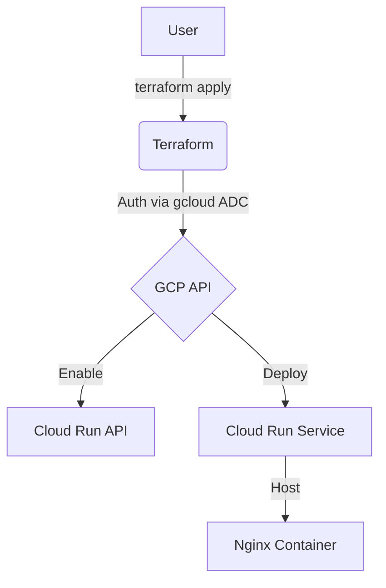
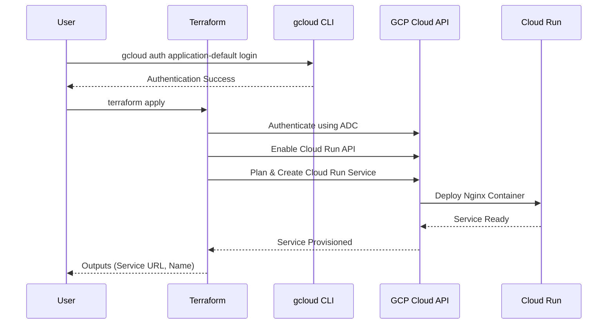

# terraform-gcp-cloudrun-container

This Terraform project provisions a Google Cloud Run service running a default Nginx container.

## Architecture

### Flowchart


### Sequence Diagram


## Connectivity
- **Inbound Access**: Publicly accessible from the internet via the generated Service URL. 
- **Outbound Access**: The container has full access to the public internet (e.g., for API calls, updates, or external dependencies).
- **Ingress Settings**: Configured to `INGRESS_TRAFFIC_ALL` to allow all external requests.

## Service Specifications (Free Tier Optimized)
- **Container Image**: `nginx:latest` (Default).
- **Location**: Restricted to `us-west1`, `us-central1`, or `us-east1` (GCP Always Free Tier regions).
- **Scaling**: `max_instance_count` set to `1` to prevent unexpected horizontal scaling costs.
- **Resources**: 
    - **CPU**: 1 vCPU (CPU only allocated during request processing to maximize free tier seconds).
    - **Memory**: 256 MiB.
- **Ingress**: `All` (Publicly accessible).
- **Authentication**: Unauthenticated access enabled.
- **Naming**: A random 8-character hex suffix is automatically appended to your `service_name` to ensure project-wide uniqueness.

## GCP Free Tier Limits (Always Free)
To stay within the free tier, ensure your usage does not exceed:
- **Requests**: 2 million requests per month.
- **Compute**: 360,000 vCPU-seconds and 180,000 GiB-seconds of memory per month.
- **Data Transfer**: 1 GB of outbound data transfer per month (within North America).

## Prerequisites
1.  **Google Cloud SDK**: `https://cloud.google.com/sdk/docs/install` .
2.  **Terraform**: `https://developer.hashicorp.com/terraform/downloads` .

## Setup & Deployment

1.  **Authenticate and Select Project**:
    Instead of using a service account JSON file, this project uses your local `gcloud` credentials.
    ```bash
    # Authenticate
    gcloud auth application-default login

    # Select your project
    gcloud config set project your-project-id
    ```

2.  **Configure Variables**:
    Create a `terraform.tfvars` file based on the example:
    ```hcl
    project_id   = "your-project-id"
    region       = "us-central1"
    service_name = "my-nginx-service"
    ```

3.  **Deploy**:
    ```bash
    # Initialize (required to download providers)
    terraform init

    # Apply changes
    terraform apply
    ```

4.  **Outputs**:
    After a successful deployment, Terraform will output the Cloud Run service URL and name.

---

## Usage as a Module

Reference this repository as a Terraform module in your own configurations:

```hcl
module "cloud_run" {
  source = "github.com/marcuwynu23/terraform-gcp-cloudrun-container?ref=main"

  project_id   = var.project_id
  region       = "us-central1"
  service_name = "my-api"
  image_url    = "nginx:latest"
}
```

Then use the outputs in your configuration:

```hcl
# Example: pass the service URL to a DNS record
output "cloud_run_url" {
  value = module.cloud_run.external_url
}
```

All [variables](#variables) and [outputs](#outputs) documented below are available when using this as a module.
